<div align="center">

  

  <br/><br/>

  [](https://narainram18.github.io)
  [](https://www.linkedin.com/in/narain-ram-207060290)
  [](mailto:narain18ram@gmail.com)
  [](https://narainram18.github.io/resume/Narain_Ram_Resume.pdf)

</div>

<br/>

## ⚡ Profile Snapshot

```yaml
Name:        Narain Ram R M
Degree:      B.Tech in Computer Science & Engineering (AI & Robotics)
Institution: Vellore Institute of Technology (VIT), Chennai — Batch of 2027
Core Focus:  Software Engineering, Distributed Systems, Concurrency, Applied AI & Robotics
Experience:  Software Development Intern @ Eanwol (Enterprise REST APIs, React, MS SQL Server)
Location:    Chennai, Tamil Nadu, India
Status:      Building systems & open to engineering opportunities
```

---

## 🛠️ Technical Capabilities

Strongly typed, production-minded engineering across the stack — grounded in actual codebases:

| Domain | Core Technologies & Primitives |
| :--- | :--- |
| **Languages** | `Java 21` · `Modern C++ (17)` · `Python 3` · `TypeScript` · `JavaScript (ES6+)` · `SQL` · `Dart` |
| **Systems & Robotics** | `ROS / ROS 2` · `Gazebo Simulation` · `POSIX / Linux` · `Multithreading & Concurrency (std::async)` · `Docker` · `MoveBase` |
| **Backend & Distributed** | `Spring Boot 3` · `Node.js / Express` · `PostgreSQL` · `Qdrant Vector DB` · `Microsoft SQL Server` · `RESTful APIs` |
| **AI & Information Retrieval**| `Ollama (Local LLMs)` · `OpenAI Whisper` · `Qwen 3.5` · `RAG (Reciprocal Rank Fusion)` · `CUDA Acceleration` · `SSE Streaming` |
| **Frontend & Mobile** | `React 18` · `Vite` · `Flutter` · `React Native` · `Tailwind CSS` · `State Management` |
| **Tooling & Engineering** | `Git / GitHub Actions` · `CMake` · `OpenSSL` · `Postman` · `Linux CLI` · `Monorepo Workflows` |

---

## 🚀 Featured Engineering Projects

A curated selection of technical projects demonstrating backend architecture, systems programming, autonomous robotics, and applied AI:

<table>
  <tr>
    <td width="50%" valign="top">
      <h3>🏢 <a href="https://github.com/narainram18/Enterprise-AI">Enterprise AI Workspace</a></h3>
      <p><b>Flagship Local-First RAG & Document Platform</b></p>
      <ul>
        <li>Hybrid information retrieval combining <b>Qdrant</b> semantic vector search with <b>PostgreSQL Full-Text Search</b> via Reciprocal Rank Fusion (RRF).</li>
        <li>Zero-trust <b>RBAC vector-level isolation</b> enforcing strict multi-tenant boundary controls.</li>
        <li>Real-time token streaming via <b>Server-Sent Events (SSE)</b> powered by locally orchestrated <b>Ollama</b> models.</li>
      </ul>
      <p><code>Java 21</code> · <code>Spring Boot 3</code> · <code>React</code> · <code>PostgreSQL</code> · <code>Qdrant</code> · <code>Docker</code></p>
      <p><b><a href="https://github.com/narainram18/Enterprise-AI">Inspect Repository →</a></b></p>
    </td>
    <td width="50%" valign="top">
      <h3>⚡ <a href="https://github.com/narainram18/C-System-Tools">Multithreaded System File Manager</a></h3>
      <p><b>High-Performance C++ Concurrency Utility</b></p>
      <ul>
        <li>Multithreaded directory crawler utilizing <code>std::async</code> to process large nested folder hierarchies concurrently across CPU cores.</li>
        <li>AES-256-CBC cryptographic pipeline implemented with <b>OpenSSL EVP</b> APIs.</li>
        <li>Secure vault mode featuring byte-level verification and automated file scrubbing.</li>
      </ul>
      <p><code>Modern C++17</code> · <code>OpenSSL</code> · <code>Multithreading</code> · <code>POSIX / Linux</code> · <code>CMake</code></p>
      <p><b><a href="https://github.com/narainram18/C-System-Tools">Inspect Repository →</a></b></p>
    </td>
  </tr>
  <tr>
    <td width="50%" valign="top">
      <h3>🤖 <a href="https://github.com/narainram18/grocery_strore">Autonomous Grocery Navigator</a></h3>
      <p><b>Sensor-Driven Autonomous Robotics & Simulation</b></p>
      <ul>
        <li>Autonomous mobile navigation node in <b>ROS</b> communicating through <code>actionlib</code> and <code>move_base_msgs</code>.</li>
        <li>2D LiDAR SLAM, dynamic costmap inflation, and obstacle avoidance planners.</li>
        <li>Gazebo physical simulation with programmatic SDF model spawning and object manipulation.</li>
      </ul>
      <p><code>ROS</code> · <code>Python</code> · <code>Gazebo</code> · <code>MoveBase</code> · <code>LiDAR SLAM</code> · <code>Path Planning</code></p>
      <p><b><a href="https://github.com/narainram18/grocery_strore">Inspect Repository →</a></b></p>
    </td>
    <td width="50%" valign="top">
      <h3>🛡️ <a href="https://github.com/narainram18/tour-safe-monorepo">Tour Safe Platform</a></h3>
      <p><b>Distributed Travel Safety Ecosystem</b></p>
      <ul>
        <li>Centralized monorepo architecture orchestrating mobile, web, and API layers using <b>Git submodules</b>.</li>
        <li>Cross-platform mobile client in <b>Flutter</b> for real-time safety telemetry and user assistance.</li>
        <li>Administrative command center in <b>React / Vite</b> backed by a scalable <b>Node.js / Express</b> REST API.</li>
      </ul>
      <p><code>Flutter</code> · <code>Dart</code> · <code>React</code> · <code>Node.js</code> · <code>Express</code> · <code>Monorepo</code></p>
      <p><b><a href="https://github.com/narainram18/tour-safe-monorepo">Inspect Repository →</a></b></p>
    </td>
  </tr>
  <tr>
    <td width="50%" valign="top">
      <h3>🎙️ <a href="https://github.com/narainram18/intelligent-meeting-summarizer">Intelligent Meeting Summarizer</a></h3>
      <p><b>Privacy-Preserving Local Audio & LLM Intelligence</b></p>
      <ul>
        <li>100% private, local meeting transcription and analysis engine with zero external API dependencies.</li>
        <li>Hardware-accelerated speech-to-text with <b>OpenAI Whisper</b> enforcing dedicated <b>NVIDIA CUDA</b> execution.</li>
        <li>Local NLP intelligence powered by <b>Qwen 3.5</b> for action item extraction and executive decision synthesis.</li>
      </ul>
      <p><code>Python</code> · <code>OpenAI Whisper</code> · <code>Qwen 3.5</code> · <code>CUDA</code> · <code>FastAPI</code></p>
      <p>
        <b><a href="https://github.com/narainram18/intelligent-meeting-summarizer">Inspect Repository →</a></b> · 
        <b><a href="https://drive.google.com/file/d/15rlP36VKNpIWSHkyOpLN5WMxYSJj184V/view?usp=sharing">Watch Video Demo ↗</a></b>
      </p>
    </td>
    <td width="50%" valign="top">
      <h3>🧠 <a href="https://github.com/narainram18/sql-repair-agent">SQL Repair Agent</a></h3>
      <p><b>Autonomous DBOps Reliability Benchmark</b></p>
      <ul>
        <li>Autonomous agent benchmark built for the <b>Meta OpenEnv Hackathon</b> acting as a Database Reliability Engineer.</li>
        <li>Evaluates agent execution inside an in-memory <b>SQLite</b> environment to inspect broken query traces.</li>
        <li>Iteratively diagnoses syntax, multi-table JOIN mismatches, and aggregation defects to synthesize verified patches.</li>
      </ul>
      <p><code>Python</code> · <code>FastAPI</code> · <code>SQLite</code> · <code>Meta OpenEnv</code> · <code>Agentic Workflows</code></p>
      <p><b><a href="https://github.com/narainram18/sql-repair-agent">Inspect Repository →</a></b></p>
    </td>
  </tr>
</table>

---

## 📊 GitHub Analytics

<div align="center">
  
  
</div>

<br/>

<div align="center">
  
</div>

---

## 🔬 Active Laboratory Focus

What I am actively benchmarking, studying, and pushing further in my development environment:

- **Distributed Systems & Consensus**: Exploring Raft consensus algorithms, write-ahead logging (WAL), and fault-tolerant replication semantics.
- **Robotics & Spatial Navigation**: Advancing SLAM benchmarks, Nav2 costmap tuning, and trajectory tracking in Gazebo / ROS 2.
- **High-Performance Inference**: Benchmarking KV-cache memory constraints and quantization formats for local LLM deployment on consumer hardware.

---

## 📬 Connect

- **Personal Portfolio**: [narainram18.github.io](https://narainram18.github.io)
- **LinkedIn**: [linkedin.com/in/narain-ram-207060290](https://www.linkedin.com/in/narain-ram-207060290)
- **Email**: [narain18ram@gmail.com](mailto:narain18ram@gmail.com)
- **GitHub**: [github.com/narainram18](https://github.com/narainram18)

<br/>

<div align="center">
  <sub>Designed &amp; Engineered by <b>Narain Ram R M</b> · Built with clean Markdown &amp; SVG · Zero Templates</sub>
</div>
